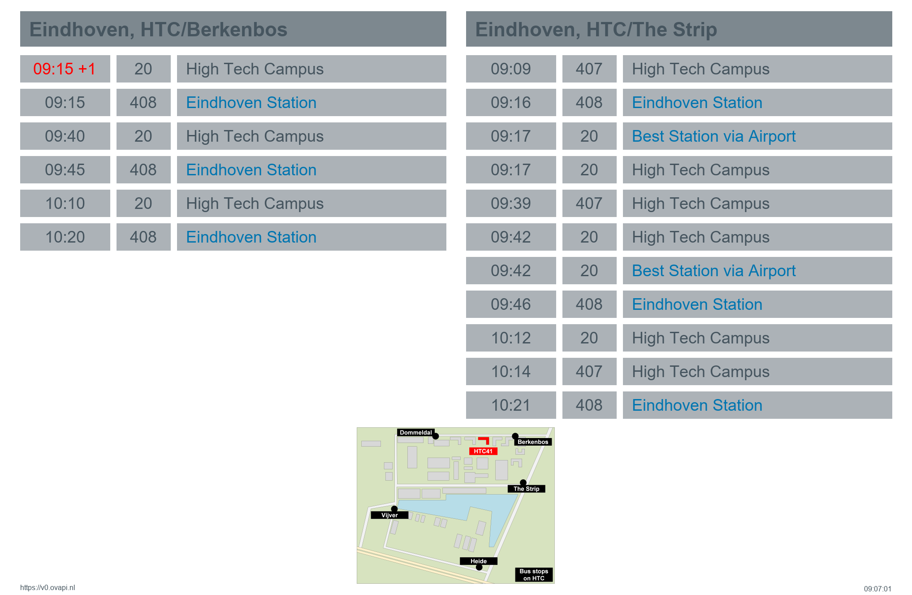

# nlbus.png
Script creating a timetable for bus stops (in the Netherlands).


## Getting started
First test this on your PC.

 - Take a PC that has Python 3.8 or up.
 - Download this whole directory `nlbus`, anywhere you want on that PC.
 - Start a `cmd.exe` in that directory.
 - Run `setup.bat`, this creates a virtual env (downloads python packages only for this project).
 - Generate a table with `run`.
 - You can `run` multiple times, but when you close `cmd` you have to run `setup` again.
 
This should generate an image like below. 
Not exactly like below, because the table is generated based on live data :-)



 
## Runtime options
This script uses the Bus server [https://v0.ovapi.nl](https://v0.ovapi.nl).
I believe the website [drpl](https://drgl.nl/) is a demo: 
[HTC/Berkenbos](https://drgl.nl/stop/NL:S:64121290) and [HTC/The Strip](https://drgl.nl/stop/NL:S:64121390).

A parameter of nlbus is a list of `stops`, e.g. `ehvhbb,ehvhts`.
To find those stops, get the list of all stops from the [bus server](https://v0.ovapi.nl/stopareacode).

Since some stops have many departures, you can limit the list length by setting `maxrow`.

My script is intended for guests of the High Tech Campus in Eindhoven (HTC).
So the script has an option to integrate a small local map (by passing `mapname`).

Finally, busses make several stops on the High Tech Campus.
I added a `lowlight` feature so that guests would be (hopefully) 
less confused to see the High Tech Campus as _destination_ on the High Tech Campus.

Feel free to play around with the parameters `stops`, `maxrow`, `lowlight` and `mapname`
in `if __name__ == "__main__" :` on line ~360.


## Diversity settings
All variables starting with `div_` govern how the generated tables will look like.
The diversity options determine horizontal and vertical spacing, background and foreground colors,
and some highlighting aspects. See line ~60 and further.


## Webserver
This module is intended to be a WSGI script in a _web server_, generating an image with bus departures.
That has not yet been tested.

You would get the departures table (of the High Tech Campus) as follows

```
nlbus.png?stops=ehvhbb,ehvhts&maxrow=7&lowlight=Campus&mapname=htc.png
```

On the webserver, you would only need `nlbus.py`, a map (`htc.png`) if you pass that in the url, and the `fonts` directory.

Line ~10 and further gives some web install instructions.


(end)

